# THE JUJUBE FARM
This is a website about a organic and sustainable community farm. The aim of this website to educate potential custumers and the local community at large about the sustainable way the farm is cultivated and how this method of farming is good for the soil, the animals and the customer. This website has three pages: home, pruduce and our story page.


The deployed website can be viewed here. [THE JUJUBE FARM](https://kaltun-dev.github.io/jujube-farm/index.html).

## UX
### User Stories
+ As a user, I want to…
1.	be able to navigate the website easily.
2.	be able to get the most important information about the farm and what it sells.
3.	be able to understand why organic and sustainable is good for me and the inviroment.
4.	be able to see multible picture about the farm.
5.  be able to know the location of the farm to visit.
+ As a site owner, I want…
1.	the information to be clear and informative.
2.	the information to be sufficiently various for all users.
3.	the website be simple to navigate.
4.  the user (potential customer) to have call of action section. 

### 1. Strategy 
 * Project Purpose
    *    To provide the user (potential customer) with suffcient information about the farm.
    * 	 To educate people about importance of the sustainable and regenrative way of farming .

### 2. Scope
 * I wanted a simple, straightforward UX experience.
 * I wanted a natural and bright color scheme.
 * I wanted my content to be clear for all users. 
 * A site that is visually appealing on most devices.
 * Information about:
     *  The farm, it's prodcts and it's story.

### 3. Structure
*	A clear layout is in place to ensure users can immediately find all the information.
*	The navbar is clean and simple with distinguished spacing between each of elements, which allows for easy and simple navigation.	
*	The Home page is containing an introductory bio, a why choose us section, a more in-dept farm bio section, a map section and a footer area with address and openiong times.
*	The produce page provides a look at all the farm's produce that can be bought.
*	The our story page contains the history and bio of the farm.
*	At the bottom of all pages is the footer section with opening times, adddress, social media icons and a trademark.

### 4. Skeleton
Wireframes created with Balsamiq. The project was developed from initial wireframes and more modifications were made during the development. 

Balsamic wireframe links for the website.

[Home](https://github.com/kaltun-dev/jujube-farm/blob/main/assets/images/Screenshot-10.png)


[our story](https://github.com/kaltun-dev/jujube-farm/blob/main/assets/images/Screenshot-11.png)


### 5. Surface
* Colours

we have paid a lot of attention to the color scheme. And used 3 colors throught the website. we've chosen green to emphasise the feeling of nature and calmness. 

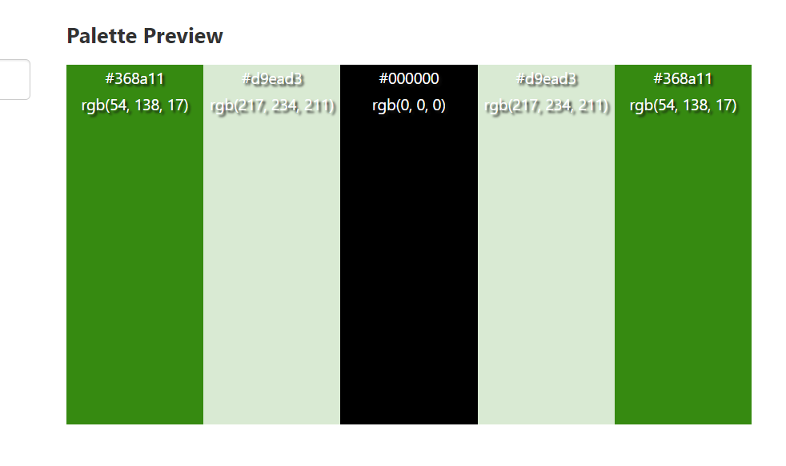

* Font Selection
 
we've used only one font for this website, and that was montserrat. This was done to keep uniformaty throughout the hole page and for simplicity reasons. The font was from [Google Fonts](https://fonts.google.com/).

## Existing Features 

+ Navigation Bar and the home page hero image

 The navigation bar and the hero image are featured on all three pages, the full responsive navigation bar includes links to the Home page, the produce page and the our story page. And is identical in each page to allow for easy navigation and consistent user experience. There are 3 diffrent hero images in all three pages to keep things fresh and un-repetative.

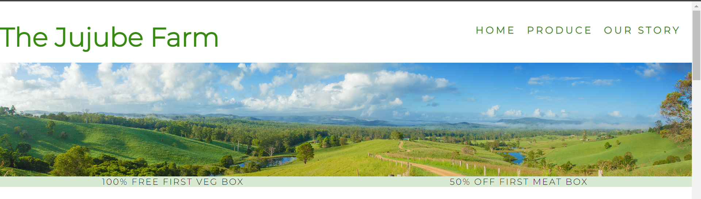

Home page is consisted of four main sections exculuding the menue and hero image:

1. A little bio section

a brief two line text about the farm.
2. A why choose us sections

a simple 3 row text with fontawsome icons indicating reasons to choose the farm. 

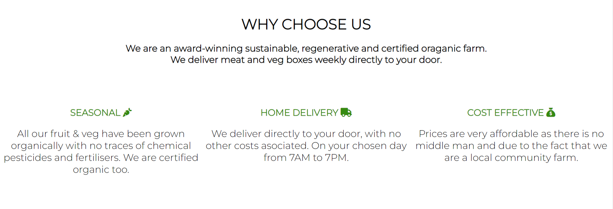

3. A three image rows with text under. 

very imformative section, talks more about the farm with images. The three rows then change to three columns that stack to become responsive.

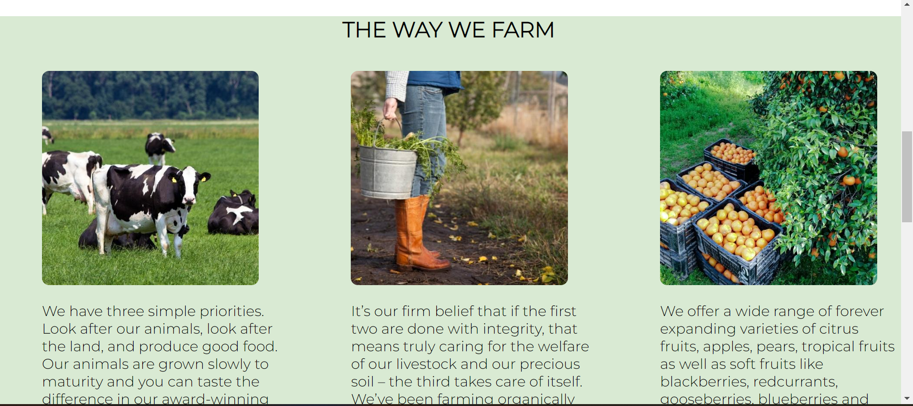

4. A google maps section and a footer section.

this iframe google map shows exacly where the farm is and how to get there.  
The footer section is packed with details about opening times, address, telephone and social media icone.

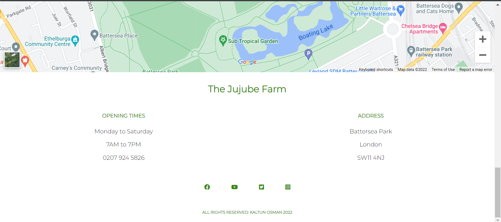

+ produce page

1. A produce/products area
this page has 6 rows containing products from the farm in the form of images and text. 
in the small mobile and tablet screen the rows turn into columns. 

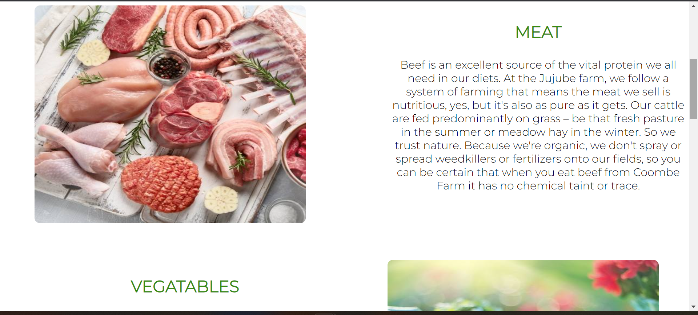

2. footer section
 
 A responsive footer that is identical in all three pages.

+ Our story page.

This page has three sections excluding, menue, hero image and the footer sections.

1. A long about us section talking about the farm and it's story.

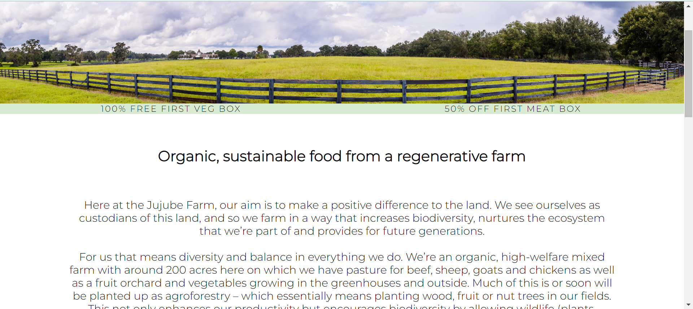
 
2. A subscribe to our news letter form 

a simple resposive form with name, email and submit button.
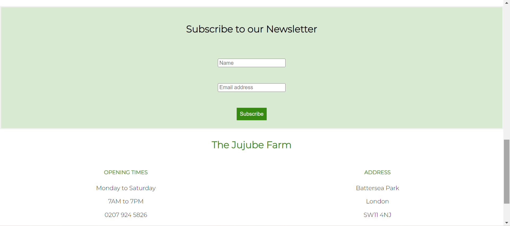

# Testing

## Automated tests

  + HTML

  This website passed the w3c html validation. there where several errors but theyhave all been fixed. [W3C validator](https://validator.w3.org/).

  website Code Validation results:
  
  #### The home page

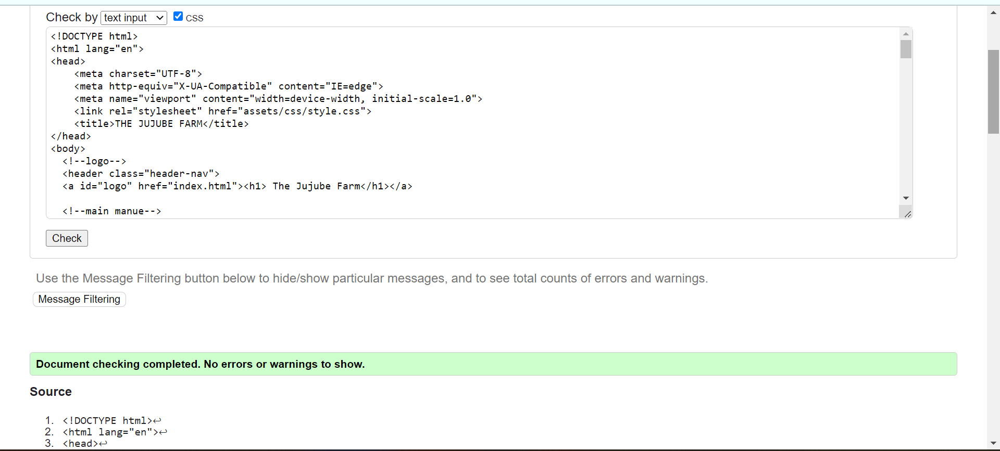
  
  #### The produce page

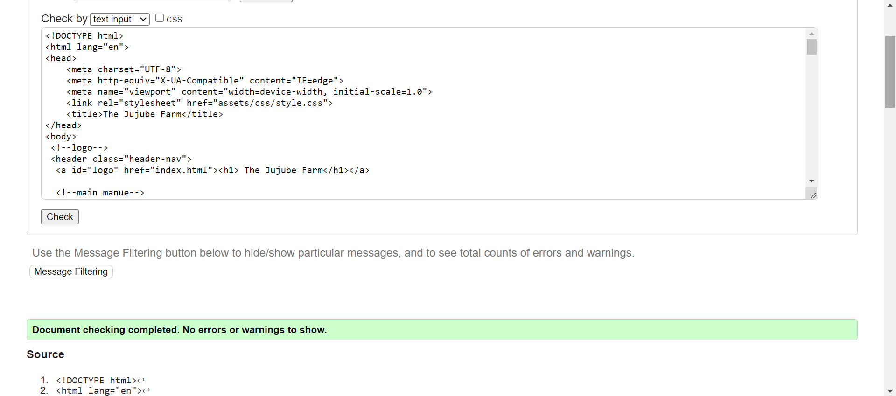

  #### The our story page

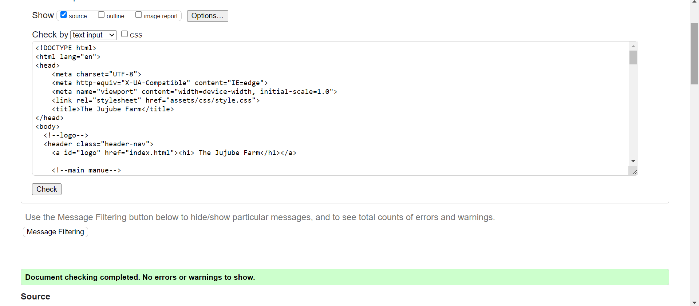

   + CSS

No errors were found when passing through the official [W3C validator](https://jigsaw.w3.org/css-validator/). 

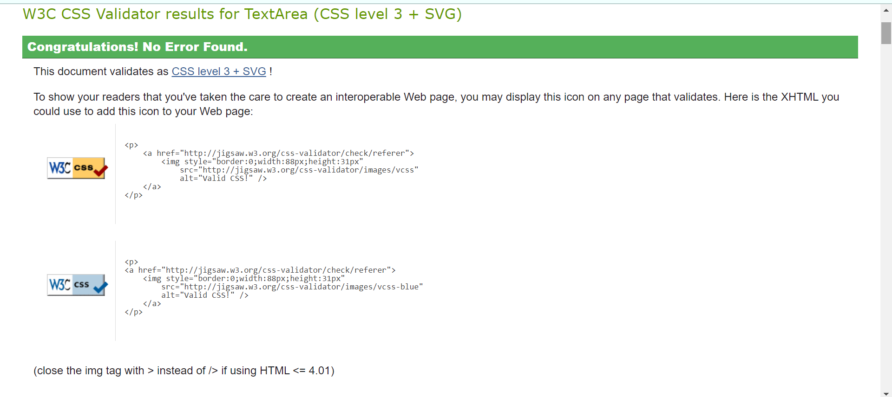

No warnings were found.

  

## Manual Testing

   + Desktop

 Everything is working good Mozilla Firefox, Google Chrome, labtop and large tablet screen . Page loads and all of the page features are working.

   + Mobile
 
 Tested with Samsung s21, Samsung tap A7, Samsung s22 and iPhone XR. It is responsive as intended.

   +  chrome dev tools lighthouse

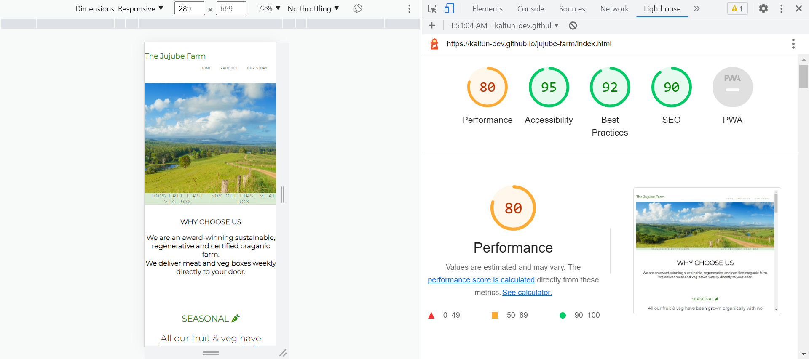

As it's shown on the image, the performance gategory is rather on the low side. This is due to some out of scope reasons such as javscript, iframe google maps, font awsome icons and large hero images that can't be rezised due to image quality dropping. However all th eother gategories are all good.

+ Mozila dev tools.
I have noticed that on the small screen the dev tools is showing a rather small menue items. This is however not an issue on chrome developer tool and all other large and small screen devices we have tested. 


+ Errors
 
During the CSS validation test, there were quite few errors. there was a one particular error where i used the same #id and same .class and a coma to seprate the two in the same div, and then used the same line of code again in the following section. As you can imagine there where arround four errors. I had to make sure there was one unique #id per div, the remove the comma and then change the css code.


## Future Features


## Project Bugs and Solutions:

 No known bugs for now.

## Deployment

 The website was deployed to GitHub pages. 
 
 * The steps to deploy are as follows: 
  - In the GitHub repository, navigate to the Settings tab; 
  - From the source section drop-down menu, select the Master Branch;
  - Once the master branch has been selected, the page will be automatically refreshed with a detailed ribbon display to indicate the successful deployment. 
The live link can be found [here](https://github.com/jurica29/Nikola-Tesla).

### Forking the GitHub Repository:

By forking the GitHub Repository you will be able to make a copy of the original repository on your own GitHub account allowing you to view and/or make changes without affecting the original repository by using the following steps:
1. Log in to GitHub and locate the [GitHub Repository](https://github.com/jurica29/Nikola-Tesla)
2. At the top of the Repository (not top of page) just above the "Settings" Button on the menu, locate the "Fork" Button.
3. You should now have a copy of the original repository in your GitHub account.

### Making a Local Clone

1. Log in to GitHub and locate the [GitHub Repository](https://github.com/jurica29/Nikola-Tesla)
2. Under the repository name, click "Clone or download".
3. To clone the repository using HTTPS, under "Clone with HTTPS", copy the link.
4. Open Git Bash
5. Change the current working directory to the location where you want the cloned directory to be made.
6. Type `git clone`, and then paste the URL you copied in Step 3.
```
$ git clone https://github.com/YOUR-USERNAME/YOUR-REPOSITORY
```
7. Press Enter. Your local clone will be created.

## Credits 

### Content

All content was written using sources as: 

- [World History Project](https://worldhistoryproject.org/topics/nikola-tesla)

- [Wikipedia](https://en.wikipedia.org/wiki/Nikola_Tesla)

### Media

- All pictures and images used in this project are from [depositphotos](https://depositphotos.com/) and [freepik](https://www.freepik.com/home).
- [Youtube](https://www.youtube.com/) videos were used on media page.
Pictures were treated (resized) with IrfanView app.

### Work based in other code

+ [Favicon generator](https://www.favicon-generator.org/) – Used to create favicon used on website.
+ [W3 Schools](https://www.w3schools.com/) - Used for variety of tutorials and deeper understanding of some important concepts related to both HTML and CSS.
+ [Online Tutorials Youtube channel](https://www.youtube.com/channel/UCbwXnUipZsLfUckBPsC7Jog) - Used for timeline code adaptation.
+ [Web Cifar Youtube channel](https://www.youtube.com/channel/UCdxaLo9ALJgXgOUDURRPGiQ) - Used for timeline code adaptation.
+ ["Love Running" footer code](https://github.com/Code-Institute-Solutions/love-running-2.0-sourcecode/tree/main/06-site-footer/02-footer-styling) - Footer adapted from this code.

### Acknowledgements

-	To the Code Institute course material, as the basis of all my knowledge is from here.
-	To the Slack community as I have used the different channels to find answers to problems!
-  Stack Overflow as a valuable resource for solving a couple of issues.
-  [W3schools](https://www.w3schools.com/) and [Stack Overflow](https://stackoverflow.com/) for general reference.

I would also like to thank to:

-	My mentor Rahul, for his time, support and guidance throughout our video calls.
-	My fiancée Maja, for all support and patience.


project jujube farm


problems
problem 1

 css wasnt beeing applied to html page in the browsser
 ive linked they sttle sgeets in all the pages but it wasnt linking ive tried stack and google but found nothing. 
 solved promelem by git add and git commit and git push.

 problem 2 

 logo h1 not displaying styling as per css rules.
 created new menue class and made display inline block. 

problem 3
hero image is too large taking the whole page and even more.

i've googled and change max-width to 100% and made height- auto but that changed nothing. trield to look at the love running project for help but that didnt work too. so i found a youtube video about the hero image and made some adjustments to the css again. that method didnt work either. so chose anothero picure and rezised it to 1600 by 500px. that sort of sorted the hero picture. but everthis was still a big mess, image was still rather too large. i will just move on the the other sections, so i dont lose a lot of time on this image, and ask help from my tutor. 
finally after soe reasearch i changed height to 69vh and width to 100%. and it works finally, for now.

problem 4

container3 center div icon is not diplaying even though the other icons are displaying fine.

i have replaced it with another icon and that seemed to have worked. 


problem 5

footer background picture wont fit the whole screen.

ive removed the padding 33px by using the inspect element and it worked.

problem 6


cant seem to change nav background color.


problem 7

font family is not sticking to elements unless i repeatedly use it in indivitual css ruls.
other problems 

h4 bio heading is not styling css
media quaries error
assets folder file paths error
hero image ssizing 
git pushing error

big eeros

page wasnt responive in small 300 to 400px screens 

after 2 days i found out the problem the why-us h3. which had a padding of 30px. make the entire page unresponsive.


